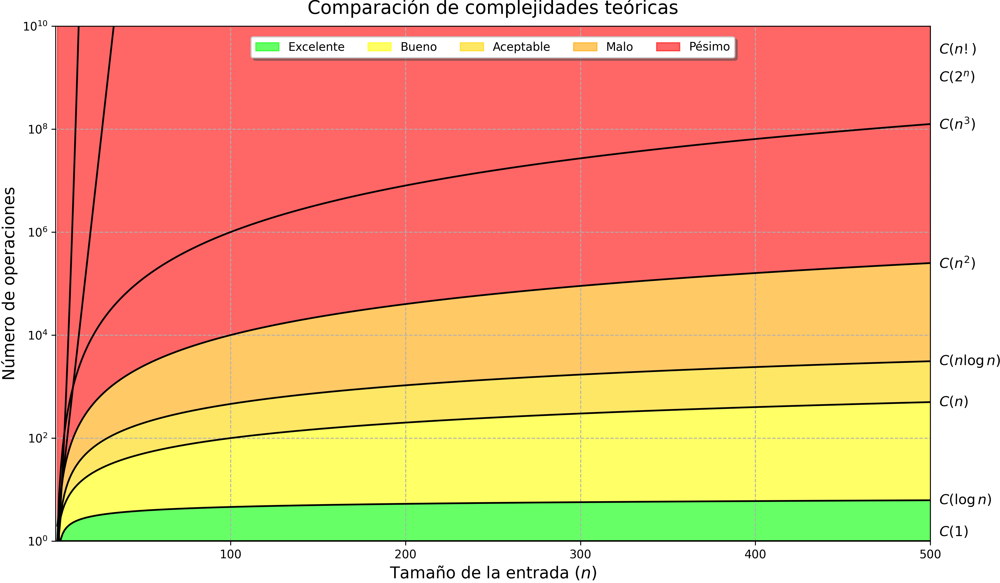

# Capítulo 2: Fundamentos del análisis de algoritmos

Este capítulo introduce una idea que aparece una y otra vez en el resto del libro: un algoritmo no solo se estudia por lo que calcula, sino también por la forma en que su costo cambia cuando aumenta el tamaño de la entrada.

La pregunta central es sencilla de formular, pero profunda en sus consecuencias:

> ¿Qué ocurre con el tiempo de ejecución y el consumo de recursos cuando el problema pasa de tener pocos datos a tener miles, millones o más?

Para responderla, el capítulo combina tres niveles de lectura:

1. una explicación conceptual de las funciones de complejidad;
2. una lectura matemática de las formas de crecimiento más comunes;
3. una guía interactiva con notebooks que permiten experimentar en paralelo al libro.

La intención no es memorizar fórmulas sueltas. La intención es aprender a reconocer patrones: cuándo una función crece lentamente, cuándo empieza a volverse costosa y cuándo deja de ser viable en la práctica.

---

## Cómo estudiar este capítulo con los notebooks

Este capítulo está pensado para leerse con el libro abierto y los notebooks ejecutándose al lado. Una buena forma de estudiarlo es seguir este ciclo:

1. Lee la explicación teórica de una función de complejidad.
2. Observa su gráfica teórica.
3. Ejecuta el ejemplo fuente.
4. Modifica los controles de la simulación.
5. Compara el tiempo teórico con el tiempo experimental.
6. Repite el experimento aumentando el tamaño de entrada o el número de ejecuciones.
7. Escribe qué cambia, qué se mantiene estable y qué resultado te sorprende.

Los notebooks no reemplazan el capítulo: lo vuelven manipulable. Sirven para convertir una curva abstracta en una experiencia visible.

---

## Objetivos de aprendizaje

Al finalizar este capítulo deberías poder:

- interpretar una función de complejidad como una relación entre el tamaño de entrada y el costo;
- distinguir entre complejidad temporal y complejidad espacial;
- reconocer las funciones de crecimiento más comunes;
- comparar funciones como $1$, $\log_2(n)$, $n$, $n\log_2(n)$, $n^2$, $n^3$, $n^k$, $2^n$ y $n!$;
- usar simulaciones experimentales para contrastar un modelo teórico con mediciones reales;
- identificar cuándo un experimento deja de ser práctico por límites de tiempo o memoria;
- preparar el terreno para la notación asintótica del Capítulo 3.

---

## Mapa del capítulo

| Sección | Tema | Pregunta guía |
|---|---|---|
| 2.1 | Función de complejidad | ¿Cómo representamos el costo de un algoritmo como función de $n$? |
| 2.1.1 | Propiedades básicas | ¿Qué condiciones debe cumplir una función para modelar complejidad? |
| 2.1.2 | Funciones teóricas comunes | ¿Qué formas de crecimiento aparecen con más frecuencia? |
| 2.1.3 | Análisis teórico | ¿Cómo estimamos tiempo y recursos antes de ejecutar? |
| 2.1.4 | Análisis práctico | ¿Qué ocurre cuando medimos el comportamiento en un entorno real? |
| 2.1.5 | Errores comunes | ¿Qué conclusiones equivocadas suelen aparecer al analizar algoritmos? |
| 2.2 | Ejercicios | ¿Cómo aplicamos los modelos a casos concretos? |

---

## 2.1 Función de complejidad

En este libro, el tamaño de entrada se representa mediante $n$. Dependiendo del problema, $n$ puede significar:

- cantidad de elementos en una lista;
- número de filas o columnas de una matriz;
- cantidad de nodos de un grafo;
- longitud de una cadena;
- número de bits necesarios para representar una entrada.

La complejidad temporal describe cómo cambia el tiempo de ejecución:

$$
T:\mathbb{N}\to\mathbb{R}_{0}^{+},\qquad n\mapsto T(n)
$$

La complejidad espacial describe cómo cambia el consumo de memoria:

$$
S:\mathbb{N}\to\mathbb{R}_{0}^{+},\qquad n\mapsto S(n)
$$

Cuando no sea necesario distinguir entre tiempo y espacio, usaremos una forma unificada:

$$
C(n)
$$

Así, $C(n)$ representa una función de costo. El punto importante es que el análisis se concentra en la forma de crecimiento, no en una medición aislada.

---

## 2.1.1 Propiedades básicas

Una función de complejidad debe ser razonable para modelar costos computacionales. En particular:

| Propiedad | Idea formal | Significado práctico |
|---|---|---|
| Dominio válido | $n\in\mathbb{N}$ | No tiene sentido hablar de $-5$ elementos o de $3.7$ nodos. |
| Valores no negativos | $C(n)\ge 0$ | El tiempo y la memoria no pueden ser negativos. |
| Lectura de crecimiento | observar qué ocurre cuando $n$ aumenta | El objetivo es entender cómo escala el costo. |
| Estabilidad conceptual | la función debe representar una tendencia | Una medición puntual puede fluctuar; la función describe el patrón. |

Esta distinción será importante en los experimentos. Una ejecución real puede variar por ruido del sistema operativo, caché, planificación del CPU o procesos en segundo plano. La función teórica, en cambio, describe la forma esperada del crecimiento.

---

## 2.1.2 Funciones de complejidad teóricas comunes

Las siguientes funciones aparecen con frecuencia al estudiar algoritmos. Conviene leerlas en orden, porque cada una introduce una forma diferente de crecimiento.

| Función $C(n)$ | Nombre | Lectura intuitiva |
|---|---|---|
| $1$ | Constante | El costo no depende de $n$. |
| $\log_2(n)$ | Logarítmica | El problema se reduce fuertemente en cada paso. |
| $n$ | Lineal | El costo crece al mismo ritmo que la entrada. |
| $n\log_2(n)$ | Log-lineal | Combina recorrido lineal con reducción logarítmica. |
| $n^2$ | Cuadrática | Suele aparecer con dos ciclos anidados. |
| $n^3$ | Cúbica | Suele aparecer con tres ciclos anidados. |
| $n^k$ | Polinomial general | Familia de potencias: $n^0$, $n^1$, $n^2$, $n^3$, ... |
| $2^n$ | Exponencial | El costo se multiplica al aumentar $n$. |
| $n!$ | Factorial | El costo explora permutaciones o arreglos posibles. |

Una forma útil de estudiar esta tabla es preguntarse:

- ¿Qué operación concreta podría producir esta función?
- ¿Qué ocurre si $n$ pasa de $10$ a $100$?
- ¿La función sigue siendo práctica si $n$ llega a $10^6$?
- ¿La gráfica parece crecer lentamente o explota muy rápido?

### Notebooks teóricos de apoyo

| Notebook | Local | Colab |
|---|---|---|
| Comparación de complejidades teóricas | [Abrir local](./general/comparacion_complejidades_teoricas.ipynb) | [Abrir en Colab](https://githubtocolab.com/Notas-a-Mano-serie-de-libros/3_notas-a-mano-sobre-analisis-de-complejidad-computacional/blob/main/capitulo2/general/comparacion_complejidades_teoricas.ipynb) |
| Complejidad polinómica | [Abrir local](./general/complejidad_polinomica.ipynb) | [Abrir en Colab](https://githubtocolab.com/Notas-a-Mano-serie-de-libros/3_notas-a-mano-sobre-analisis-de-complejidad-computacional/blob/main/capitulo2/general/complejidad_polinomica.ipynb) |

---

## 2.1.3 Análisis teórico de tiempo y recursos

Para conectar las funciones con magnitudes interpretables, el capítulo usa dos aproximaciones:

$$
t\approx T_0\cdot T(n)
$$

$$
s\approx S_0\cdot S(n)
$$

donde:

- $T_0$ representa el costo temporal promedio de una operación;
- $S_0$ representa el consumo promedio de recursos por operación;
- $T(n)$ representa la forma temporal;
- $S(n)$ representa la forma espacial.

En los ejemplos del capítulo se usan valores canónicos para hacer comparaciones:

$$
T_0=10^{-6}\,[s]=1\,[\mu s]
$$

$$
S_0=1\,[\text{byte}]
$$

Estos valores no pretenden describir todo hardware posible. Funcionan como una lupa: permiten ver cómo una misma entrada puede ser manejable para una función y completamente inviable para otra.

### Qué observar en las tablas teóricas

Cuando compares funciones, no mires solo la primera fila. Observa cómo cambia cada columna cuando $n$ aumenta por órdenes de magnitud:

- las funciones constantes casi no se mueven;
- las logarítmicas crecen extremadamente lento;
- las lineales son predecibles;
- las cuadráticas y cúbicas crecen con fuerza;
- las exponenciales y factoriales se vuelven impracticables con entradas pequeñas.

### Notebooks de análisis de alta complejidad

| Notebook | Local | Colab |
|---|---|---|
| Análisis de alta complejidad temporal | [Abrir local](./analisis_eficiencia/complejidad_temporal/analisis_alta_complejidad.ipynb) | [Abrir en Colab](https://githubtocolab.com/Notas-a-Mano-serie-de-libros/3_notas-a-mano-sobre-analisis-de-complejidad-computacional/blob/main/capitulo2/analisis_eficiencia/complejidad_temporal/analisis_alta_complejidad.ipynb) |
| Análisis de alta complejidad espacial | [Abrir local](./analisis_eficiencia/complejidad_espacial/analisis_alta_complejidad.ipynb) | [Abrir en Colab](https://githubtocolab.com/Notas-a-Mano-serie-de-libros/3_notas-a-mano-sobre-analisis-de-complejidad-computacional/blob/main/capitulo2/analisis_eficiencia/complejidad_espacial/analisis_alta_complejidad.ipynb) |

---

## 2.1.4 Laboratorio interactivo: complejidad experimental

La parte interactiva del capítulo está formada por notebooks ejecutables. Cada notebook tiene una estructura similar:

1. explicación de la forma teórica;
2. gráfica del comportamiento esperado;
3. ejemplo de código fuente;
4. simulación temporal;
5. simulación espacial, cuando aplica;
6. tabla con valores teóricos y experimentales.

La tabla experimental no debe leerse como una verdad absoluta. Debe leerse como evidencia: una forma de observar si el comportamiento medido se parece a la forma teórica.

Los detalles de uso, controles y columnas de las tablas están en la [guía específica del laboratorio experimental](./analisis_complejidad_temporal_experimental/README.md).

---

## Ruta recomendada de estudio interactivo

Sigue los notebooks en este orden. La dificultad conceptual y computacional aumenta de forma gradual.

| Orden | Notebook | Ejemplo | Qué deberías observar |
|---:|---|---|---|
| 1 | [1_complejidad_constante.ipynb](./analisis_complejidad_temporal_experimental/1_complejidad_constante.ipynb) | Acceso a una posición de un arreglo | La figura debería mantenerse casi plana aunque $n$ aumente. |
| 2 | [2_complejidad_logaritmica.ipynb](./analisis_complejidad_temporal_experimental/2_complejidad_logaritmica.ipynb) | Búsqueda binaria | La curva crece muy lento, incluso para entradas enormes. |
| 3 | [3_complejidad_lineal.ipynb](./analisis_complejidad_temporal_experimental/3_complejidad_lineal.ipynb) | Búsqueda secuencial | Duplicar $n$ tiende a duplicar el costo. |
| 4 | [4_complejidad_log_lineal.ipynb](./analisis_complejidad_temporal_experimental/4_complejidad_log_lineal.ipynb) | Ordenar una lista | Crece más que lineal, pero mucho menos que cuadrática. |
| 5 | [5_complejidad_cuadratica.ipynb](./analisis_complejidad_temporal_experimental/5_complejidad_cuadratica.ipynb) | Recorrer una matriz | Aumentar $n$ impacta con más fuerza por el doble recorrido. |
| 6 | [6_complejidad_cubica.ipynb](./analisis_complejidad_temporal_experimental/6_complejidad_cubica.ipynb) | Multiplicación clásica de matrices | La tercera dimensión de iteración vuelve el costo rápidamente visible. |
| 7 | [7_complejidad_polinomial_general.ipynb](./analisis_complejidad_temporal_experimental/7_complejidad_polinomial_general.ipynb) | Familia $n^k$ | El grado $k$ controla qué tan pronunciada es la curva. |
| 8 | [8_complejidad_exponencial.ipynb](./analisis_complejidad_temporal_experimental/8_complejidad_exponencial.ipynb) | Fibonacci recursivo | El costo se dispara con entradas pequeñas. |
| 9 | [9_complejidad_factorial.ipynb](./analisis_complejidad_temporal_experimental/9_complejidad_factorial.ipynb) | Conteo de permutaciones | El crecimiento factorial se vuelve inviable casi de inmediato. |

Si necesitas una descripción más operativa de cada simulación, abre el [README del laboratorio](./analisis_complejidad_temporal_experimental/README.md).

---

## Preguntas para estudiar mientras ejecutas

Usa estas preguntas como guía de lectura activa:

1. ¿Qué representa $n$ en este ejemplo?
2. ¿La función teórica depende de recorrer todos los datos?
3. ¿Qué parte del código fuente produce la forma de crecimiento?
4. ¿La gráfica experimental se parece a la teórica?
5. ¿Qué ocurre cuando aumentas el número de ejecuciones?
6. ¿El costo crece lentamente, de forma proporcional o de forma explosiva?
7. ¿En qué punto el experimento deja de ser razonable para ejecutarse?
8. ¿El límite aparece por tiempo, por memoria o por ambos?

Una buena práctica es anotar una frase por notebook. Por ejemplo:

> En la búsqueda binaria, aumentar mucho $n$ no aumenta mucho el número de pasos porque el problema se divide por la mitad en cada iteración.

---

## Errores comunes al interpretar los experimentos

| Error | Por qué ocurre | Cómo evitarlo |
|---|---|---|
| Confundir ruido experimental con crecimiento real | Las mediciones pequeñas pueden fluctuar por el sistema operativo o el hardware. | Repite ejecuciones y mira la tendencia, no una sola fila. |
| Comparar funciones con escalas incompatibles | Una curva dominante puede hacer que otras parezcan planas. | Observa los valores de la tabla además de la figura. |
| Ejecutar tamaños demasiado grandes sin revisar advertencias | Algunas funciones crecen demasiado rápido. | Lee el aviso teórico antes de saltar límites. |
| Pensar que más hardware soluciona cualquier algoritmo | Algunas funciones crecen tan rápido que el hardware solo retrasa el problema. | Compara cómo cambia el costo por órdenes de magnitud. |
| Ignorar memoria por mirar solo tiempo | Un algoritmo puede ser rápido pero consumir demasiados recursos. | Ejecuta también la simulación espacial cuando esté disponible. |

---

## Síntesis visual del capítulo

La siguiente figura resume la intuición central: no todas las funciones responden igual cuando aumenta $n$.

  

<em>Figura:</em> comparación de formas de crecimiento para funciones de complejidad comunes.

---

## Ejercicios propuestos

Los ejercicios buscan que practiques el cálculo de tiempo y recursos usando:

$$
t=T_0\cdot T(n)
$$

$$
s=S_0\cdot S(n)
$$

Antes de resolverlos, identifica siempre:

- qué representa $n$;
- cuál es la función temporal $T(n)$;
- cuál es la función espacial $S(n)$;
- qué unidad usa cada constante;
- si el resultado final debe expresarse en segundos, minutos, horas, bytes, KB, MB o GB.

1. Una máquina consume $0.001\,[s]$ por operación y $8\,[\text{bytes}]$ de memoria por instrucción. Calcula el tiempo total y el consumo total para $T(n)=n$, $S(n)=n$; $T(n)=n\log_2(n)$, $S(n)=\log_2(n)$; $T(n)=\sqrt{n}$, $S(n)=\log_2(n)$, con $n=10^6$.
2. Una operación básica toma en promedio $0.002\,[s]$ y $T(n)=n^3$. Para $n=500$, determina el tiempo total de ejecución y cuántas instrucciones puede ejecutar antes de consumir $1\,[GB]$ si consume $16\,[\text{bytes}]$ por operación.
3. Un algoritmo tiene $T(n)=2^n$ y $S(n)=n!$. Con $T_0=0.0005\,[s]$ y $S_0=4\,[\text{bytes}]$, determina tiempo y consumo para $n\in\{1,10,100,1000,10000\}$ y discute los resultados.
4. Un sistema necesita procesar $n=10^6$ datos en menos de $10\,[s]$. La máquina ejecuta instrucciones a $0.001\,[s]$ por instrucción. Determina la función de complejidad temporal más adecuada que cumpla con estas restricciones.
5. Supón que tienes tres algoritmos: $A_1(n)=n\log_2(n)$, $A_2(n)=n^2$, $A_3(n)=10n^2$. Si $n=10^5$ y $T_0=0.002\,[s]$, determina el tiempo de ejecución de cada algoritmo.
6. Diseña un algoritmo que procese $10^7$ datos en menos de $5\,[s]$. Determina un conjunto de funciones de complejidad que cumplan con esta restricción.
7. Por restricciones físicas, una máquina solo cuenta con $128\,[MB]$ de memoria. Determina la complejidad tentativa que debe tener un algoritmo capaz de procesar $10^5$ datos.
8. Estima el tiempo de ejecución para procesar $10^6$ datos usando $T(n)=n!$, asumiendo que cada instrucción toma $10^{-5}\,[s]$.
9. Un algoritmo con $S(n)=n\log_2(n)$ consume $16\,[\text{bytes}]$ en cada operación. Determina cuántos kilobytes y kibibytes consume si recibe $10000$ datos.
10. Calcula cuánto tiempo tomaría procesar $20$ datos en un algoritmo con $T(n)=2^n$, asumiendo que cada instrucción toma $1\,[s]$. ¿Es útil en la práctica?
11. Un algoritmo con $T(n)=n^2$ tarda $0.01\,[s]$ en procesar $1000$ datos. Estima el tiempo para procesar $100000$ datos, asumiendo que el comportamiento se mantiene estable.
12. Se requiere implementar un algoritmo que procese $10000$ datos en menos de $1\,[s]$. Identifica qué órdenes de complejidad temporal lo permitirían en una máquina que ejecuta $10^7$ instrucciones por segundo.
13. Un sistema de distribución utiliza $S(n)=2^n$ y logra procesar $20$ datos sin inconvenientes. Determina cuánta memoria requeriría para $25$ datos, expresando el resultado en una unidad adecuada.
14. Un sistema embebido es capaz de realizar $10^6$ operaciones por segundo, con solo $1\,[MB]$ de memoria. Determina qué órdenes de complejidad temporal y espacial permitirían procesar $5000$ datos de forma eficiente.
15. Un algoritmo con $T(n)=n\log_2(n)$ tarda $2\,[s]$ en procesar $1000$ datos. Estima si es posible procesar $10000$ datos en menos de $10\,[s]$ bajo el mismo modelo.

Soluciones:

- [Ver soluciones – Ejercicios propuestos del Capítulo 2](https://drive.google.com/file/d/16_BOFsSW8auL9230VSRZU79gesjlDzpW/view)

---

## Mini-glosario

| Término | Significado |
|---|---|
| $n$ | Tamaño de la entrada. |
| $T(n)$ | Función que modela el costo temporal. |
| $S(n)$ | Función que modela el consumo espacial o de recursos. |
| $C(n)$ | Función genérica de complejidad. |
| Tiempo teórico | Estimación calculada desde la función de costo. |
| Tiempo experimental | Medición obtenida al ejecutar código real. |
| Solo teórico | Punto que se muestra como referencia, pero no se ejecuta por costo excesivo. |
| Orden de magnitud | Cambio multiplicativo, usualmente por potencias de 10. |

---

## Guías complementarias del capítulo

| Recurso | Descripción |
|---|---|
| [Laboratorio de complejidad experimental](./analisis_complejidad_temporal_experimental/README.md) | Guía de notebooks interactivos, controles y enlaces local/Colab. |
| [Análisis de eficiencia](./analisis_eficiencia/README.md) | Guía para los notebooks de límites temporales y espaciales. |
| [Comparación de complejidades teóricas](./general/comparacion_complejidades_teoricas.ipynb) | Notebook de apoyo para comparar formas de crecimiento. |
| [Complejidad polinómica](./general/complejidad_polinomica.ipynb) | Notebook de apoyo para estudiar la familia \(n^k\). |

---

## Cierre del capítulo

El análisis de algoritmos empieza con una intuición sencilla: medir no basta; hay que entender cómo crece lo que medimos.

Este capítulo construye esa intuición desde dos direcciones. Por un lado, presenta funciones teóricas que permiten describir el costo de un algoritmo. Por otro, usa simulaciones interactivas para mostrar que ejecutar código real introduce ruido, límites y decisiones prácticas.

La idea que conviene llevar al siguiente capítulo es esta:

> La forma de crecimiento importa más que un tiempo aislado.

El Capítulo 3 tomará esta intuición y la formalizará mediante notación asintótica.

---

## Licencia

El contenido de este capítulo se distribuye bajo la licencia **Creative Commons Attribution-NonCommercial 4.0 International (CC BY-NC 4.0)**. Se autoriza su uso y adaptación con fines académicos siempre que se cite la fuente original.

© 2026 Carlos Eduardo Orozco Garcés, César Jesús Pardo Calvache, Mauro Callejas Cuervo
