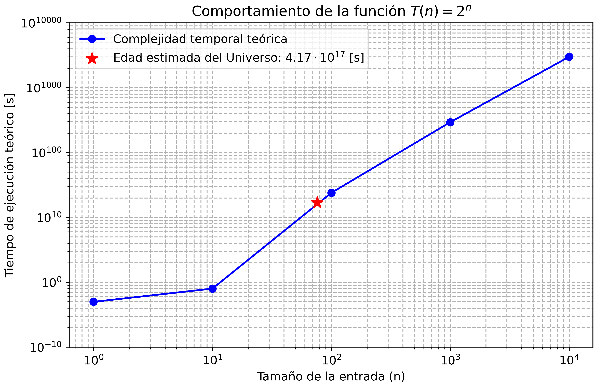
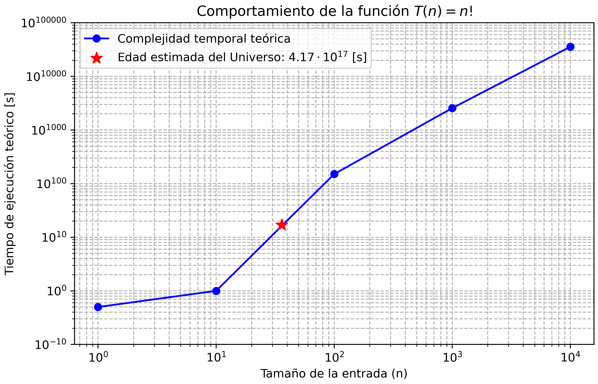
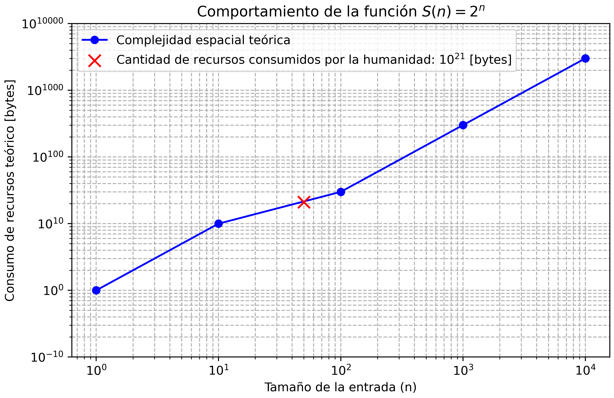
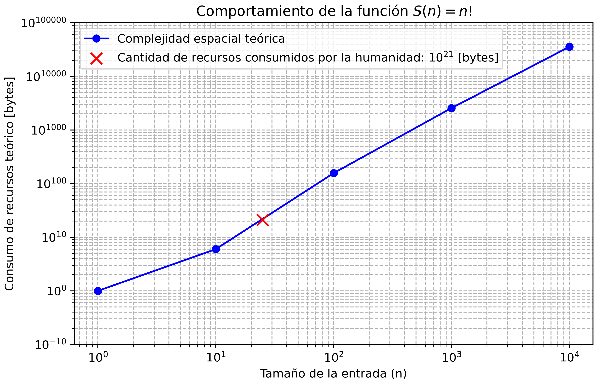

<h1 style="text-align:center;">
<strong>Análisis de eficiencia</strong> 
</h1>

---

## ⏱️ Complejidad temporal

La <b>complejidad temporal</b> cuantifica el número de operaciones o pasos que un algoritmo necesita para completarse en función del tamaño de entrada <i>n</i>.  
Cuando esta función de crecimiento pertenece a órdenes <b>polinomiales</b>, <b>exponenciales</b> o <b>factoriales</b>, el tiempo de ejecución se incrementa tan rápidamente que se torna <b>inviable en la práctica</b>, incluso para valores relativamente pequeños.

Los algoritmos con crecimiento polinomial (𝒪(n²), 𝒪(n³)) pueden tolerarse para entradas moderadas, pero los de crecimiento exponencial o factorial conducen a escalas de tiempo astronómicas.  
En estos casos, el número de operaciones crece más rápido que la capacidad de procesamiento de cualquier sistema físico imaginable.

Por ejemplo, un algoritmo con complejidad 𝒪(2ⁿ) duplica el número de pasos por cada incremento unitario de <i>n</i>.  
Si se ejecutaran mil millones de operaciones por segundo, bastaría un valor de <i>n = 50</i> para que el tiempo total de ejecución <b>superara la edad estimada del universo</b> (≈ 13.8 × 10⁹ años).  
De manera similar, un algoritmo 𝒪(n!) se vuelve inabordable antes de <i>n = 25</i>, pues el número de posibles ejecuciones excede cualquier escala temporal concebible.

Estos resultados muestran que la complejidad temporal no es un problema de optimización secundaria, sino un <b>límite físico absoluto</b>.  
Más allá de cierto punto, no existe máquina, paralelismo o tecnología que permita completar el cálculo dentro del tiempo que el universo mismo ofrece.

  

<em>Figura 1:</em> Crecimiento exponencial 𝒪(2ⁿ) comparado con el tiempo de vida estimado del universo.

  

<em>Figura 2:</em> Crecimiento factorial 𝒪(n!) y su equivalencia temporal con escalas cósmicas.

Comprender este tipo de crecimiento permite apreciar por qué la <b>eficiencia temporal</b> es un criterio esencial en el diseño algorítmico.  
Evitar órdenes elevados no solo mejora el rendimiento: determina si un problema puede ser resuelto dentro del universo observable.

---

## 💾 Complejidad espacial

La <b>complejidad espacial</b> mide la cantidad de memoria necesaria para que un algoritmo procese una entrada de tamaño <i>n</i>.  
Su análisis permite determinar cuántos datos intermedios, estructuras auxiliares o copias de información deben mantenerse en memoria durante la ejecución.

Cuando la función de crecimiento espacial pertenece a órdenes <b>exponenciales</b> o <b>factoriales</b>, la cantidad de memoria requerida crece tan rápidamente que se vuelve imposible de representar físicamente.  
Incluso con tecnologías avanzadas de almacenamiento, la información necesaria <b>excede la capacidad total del planeta</b> o de cualquier medio concebible.

Por ejemplo, un algoritmo con complejidad 𝒪(2ⁿ) duplicaría la memoria usada con cada incremento unitario de <i>n</i>.  
A partir de <i>n ≈ 40</i>, el espacio requerido sería tan grande que saturaría cualquier servidor moderno.  
Y para 𝒪(n!), el número de configuraciones posibles alcanzaría valores superiores a 10²⁵, superando la <b>cantidad total de bits que podrían almacenarse si cada átomo de la Tierra fuera una unidad de memoria</b>.

En estos contextos, el problema ya no es el tiempo de ejecución, sino la <b>imposibilidad material</b> de mantener en memoria todos los estados intermedios o resultados posibles.  
El crecimiento espacial, por tanto, establece límites tan estrictos como los del tiempo: ningún sistema puede almacenar una cantidad infinita de combinaciones.

  

<em>Figura 3:</em> Crecimiento espacial 𝒪(2ⁿ) comparado con la capacidad total de almacenamiento humano.

  

<em>Figura 4:</em> Crecimiento espacial 𝒪(n!) comparado con la información total generada por la humanidad.

Este tipo de análisis evidencia que el diseño de estructuras de datos eficientes y la minimización del espacio ocupado son <b>condiciones esenciales para la viabilidad computacional</b>.  
Un algoritmo eficiente no solo debe ser rápido: también debe ser capaz de <b>existir dentro de los límites físicos del almacenamiento disponible</b>.

---

## 🧠 Conclusión

El estudio de la <b>complejidad temporal y espacial</b> en órdenes de magnitud elevados permite reconocer los <b>límites reales del cómputo</b>.  
Ambas dimensiones muestran que la eficiencia no es un asunto de conveniencia, sino de posibilidad.  
Cuando el crecimiento de una función supera los recursos del universo observable, el problema deja de ser computable en términos físicos.

Por ello, el diseño algorítmico moderno se basa en <b>estrategias de reducción, aproximación y paralelismo</b> que buscan mantener el equilibrio entre tiempo, espacio y viabilidad.  
La eficiencia, en última instancia, constituye la frontera entre la teoría matemática y la realidad computacional.

---

## 📎 Archivos de referencia

<ul>
  <li><a href="./complejidad_temporal/analisis_alta_complejidad.ipynb"><code>complejidad_temporal/analisis_alta_complejidad.ipynb</code></a></li>
  <li><a href="./complejidad_espacial/analisis_alta_complejidad.ipynb"><code>complejidad_espacial/analisis_alta_complejidad.ipynb</code></a></li>
</ul>

---

## 🧾 Licencia

El contenido de esta sección se distribuye bajo la licencia  
<b>Creative Commons Attribution-NonCommercial 4.0 International (CC BY-NC 4.0)</b>.  
Se autoriza su uso y adaptación con fines académicos siempre que se cite la fuente original.

© 2025 Carlos Eduardo Orozco

