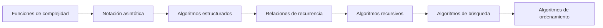

# Recorrido por capítulos

Los capítulos están conectados: cada uno introduce herramientas que el siguiente utiliza. La ruta recomendada evita estudiar los algoritmos como listas aisladas de fórmulas.

| Capítulo | Pregunta que resuelve | Páginas |
| :---: | --- | :---: |
| [2](capitulo-2.md) | ¿Cómo modelamos el costo cuando crece la entrada? | 59–88 |
| [3](capitulo-3.md) | ¿Cómo comparamos formalmente órdenes de crecimiento? | 89–132 |
| [4](capitulo-4.md) | ¿Cómo se obtiene el costo desde la estructura del código? | 133–178 |
| [5](capitulo-5.md) | ¿Cómo se representan y resuelven costos recursivos? | 179–222 |
| [6](capitulo-6.md) | ¿Cómo se analiza un algoritmo recursivo completo? | 223–258 |
| [7](capitulo-7.md) | ¿Qué búsqueda conviene según los datos? | 259–316 |
| [8](capitulo-8.md) | ¿Qué ordenamiento conviene según el contexto? | 317–370 |

!!! tip "Cómo estudiar"
    Lee primero la sección correspondiente de la obra, predice el comportamiento del problema y abre después el laboratorio. La simulación resulta más útil cuando sirve para contrastar una hipótesis previa.
