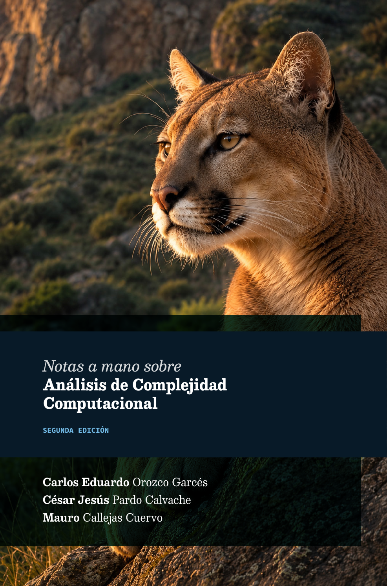

  

    
  

  

    <h1>Notas a mano sobre análisis de complejidad computacional</h1>
    
Segunda edición · 2026

    
Complemento digital de la obra. Síntesis conceptuales, comparaciones y laboratorios de los capítulos 2–8.

    <ul class="book-hero__authors" aria-label="Autores de la obra">
      <li>Carlos Eduardo Orozco Garcés</li>
      <li>César Jesús Pardo Calvache</li>
      <li>Mauro Callejas Cuervo</li>
    </ul>
    

      <a class="md-button md-button--primary" href="capitulos/">Explorar capítulos</a>
      <a class="md-button" href="recursos/">Usar los laboratorios</a>
    

  

## Recorrido de la obra

La obra avanza desde las funciones que modelan el costo computacional hasta el análisis de algoritmos estructurados, recursivos, de búsqueda y de ordenamiento. Este sitio conserva esa secuencia y añade puntos de acceso a los recursos ejecutables.

  <a class="chapter-entry" href="capitulos/capitulo-2/">02<strong>Fundamentos</strong>Funciones de complejidad, tiempo, espacio y análisis práctico.</a>
  <a class="chapter-entry" href="capitulos/capitulo-3/">03<strong>Notación asintótica</strong>Familias, cotas, propiedades, límites y casos de análisis.</a>
  <a class="chapter-entry" href="capitulos/capitulo-4/">04<strong>Algoritmos estructurados</strong>Secuencias, condicionales, ciclos, operaciones y memoria.</a>
  <a class="chapter-entry" href="capitulos/capitulo-5/">05<strong>Relaciones de recurrencia</strong>Reducción, división y métodos de solución.</a>
  <a class="chapter-entry" href="capitulos/capitulo-6/">06<strong>Algoritmos recursivos</strong>Relaciones temporales, pila de ejecución y ejemplos.</a>
  <a class="chapter-entry" href="capitulos/capitulo-7/">07<strong>Algoritmos de búsqueda</strong>Seis estrategias, comparación general y ejercicios.</a>
  <a class="chapter-entry" href="capitulos/capitulo-8/">08<strong>Algoritmos de ordenamiento</strong>Seis algoritmos clásicos, comparación y soluciones.</a>

  <strong>Nota editorial</strong> Cada página distingue el contenido de la obra de las ampliaciones del repositorio y ofrece acceso directo al notebook, al enunciado o a su solución. <a href="recursos/">Cómo ejecutar los recursos →</a>

## Tres maneras de usar este sitio

| Si quieres… | Empieza por… |
| --- | --- |
| Seguir el libro en orden | [Recorrido por capítulos](capitulos/index.md) |
| Revisar la base matemática | [Consideraciones teóricas](consideraciones-teoricas.md) |
| Comparar técnicas concretas | [Búsquedas](algoritmos/busquedas.md) o [ordenamientos](algoritmos/ordenamientos.md) |
| Consultar una definición | [Glosario](glosario.md) |

!!! note "Alcance"
    El sitio orienta, resume y conecta los recursos de la obra. No reemplaza sus definiciones, demostraciones, implementaciones ni análisis completos.
