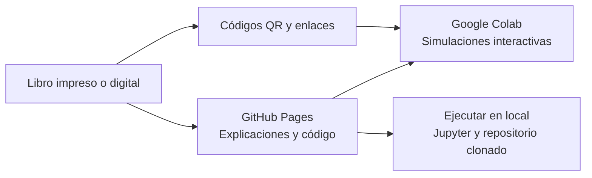

  

    
  

  

    <h1>Notas a mano sobre análisis de complejidad computacional</h1>
    
Segunda edición · 2026

    
Complemento digital de la obra. Síntesis conceptuales de los capítulos 1–9 y laboratorios ejecutables para los capítulos 2–8.

    <ul class="book-hero__authors" aria-label="Autores de la obra">
      <li>Carlos Eduardo Orozco Garcés</li>
      <li>César Jesús Pardo Calvache</li>
      <li>Mauro Callejas Cuervo</li>
    </ul>
    

      <a class="md-button md-button--primary book-hero__explore" href="capitulos/">
        <svg class="book-hero__explore-icon" aria-hidden="true" viewBox="0 0 24 24" focusable="false">
          <path d="m19 1-5 5v11l5-4.5zm2 4v13.5c-1.1-.35-2.3-.5-3.5-.5-1.7 0-4.15.65-5.5 1.5V6c-1.45-1.1-3.55-1.5-5.5-1.5S2.45 4.9 1 6v14.65c0 .25.25.5.5.5.1 0 .15-.05.25-.05C3.1 20.45 5.05 20 6.5 20c1.95 0 4.05.4 5.5 1.5 1.35-.85 3.8-1.5 5.5-1.5 1.65 0 3.35.3 4.75 1.05.1.05.15.05.25.05.25 0 .5-.25.5-.5V6c-.6-.45-1.25-.75-2-1M10 18.41C8.75 18.09 7.5 18 6.5 18c-1.06 0-2.32.19-3.5.5V7.13c.91-.4 2.14-.63 3.5-.63s2.59.23 3.5.63z"/>
        </svg>
        Explorar capítulos
      </a>
      <a class="md-button md-button--primary book-hero__authors-link" href="autores/">
        <svg class="book-hero__authors-icon" aria-hidden="true" viewBox="0 0 24 24" focusable="false">
          <path d="M12 5a3.5 3.5 0 0 0-3.5 3.5A3.5 3.5 0 0 0 12 12a3.5 3.5 0 0 0 3.5-3.5A3.5 3.5 0 0 0 12 5m0 2a1.5 1.5 0 0 1 1.5 1.5A1.5 1.5 0 0 1 12 10a1.5 1.5 0 0 1-1.5-1.5A1.5 1.5 0 0 1 12 7M5.5 8A2.5 2.5 0 0 0 3 10.5c0 .94.53 1.75 1.29 2.18.36.2.77.32 1.21.32s.85-.12 1.21-.32c.37-.21.68-.51.91-.87A5.42 5.42 0 0 1 6.5 8.5v-.28c-.3-.14-.64-.22-1-.22m13 0c-.36 0-.7.08-1 .22v.28c0 1.2-.39 2.36-1.12 3.31.12.19.25.34.4.49a2.482 2.482 0 0 0 1.72.7c.44 0 .85-.12 1.21-.32.76-.43 1.29-1.24 1.29-2.18A2.5 2.5 0 0 0 18.5 8M12 14c-2.34 0-7 1.17-7 3.5V19h14v-1.5c0-2.33-4.66-3.5-7-3.5m-7.29.55C2.78 14.78 0 15.76 0 17.5V19h3v-1.93c0-1.01.69-1.85 1.71-2.52m14.58 0c1.02.67 1.71 1.51 1.71 2.52V19h3v-1.5c0-1.74-2.78-2.72-4.71-2.95M12 16c1.53 0 3.24.5 4.23 1H7.77c.99-.5 2.7-1 4.23-1"/>
        </svg>
        Sobre los autores
      </a>
      <a class="md-button md-button--primary book-hero__series-link" href="https://www.amazon.com/dp/B0DH2Z4VHD" target="_blank" rel="noopener noreferrer">
        <svg class="book-hero__series-icon" aria-hidden="true" viewBox="0 0 24 24" focusable="false">
          <path d="M9 3v15h3V3zm3 2 4 13 3-1-4-13zM5 5v13h3V5zM3 19v2h18v-2z"/>
        </svg>
        Serie Notas a Mano
      </a>
      <a class="md-button md-button--primary book-hero__purchase-link" href="https://www.amazon.com/dp/B0HJYGTGZM" target="_blank" rel="noopener noreferrer">
        <svg class="book-hero__purchase-icon" aria-hidden="true" viewBox="0 0 24 24" focusable="false">
          <path d="M17 18a2 2 0 0 1 2 2 2 2 0 0 1-2 2 2 2 0 0 1-2-2c0-1.11.89-2 2-2M1 2h3.27l.94 2H20a1 1 0 0 1 1 1c0 .17-.05.34-.12.5l-3.58 6.47c-.34.61-1 1.03-1.75 1.03H8.1l-.9 1.63-.03.12a.25.25 0 0 0 .25.25H19v2H7a2 2 0 0 1-2-2c0-.35.09-.68.24-.96l1.36-2.45L3 4H1zm6 16a2 2 0 0 1 2 2 2 2 0 0 1-2 2 2 2 0 0 1-2-2c0-1.11.89-2 2-2m9-7 2.78-5H6.14l2.36 5z"/>
        </svg>
        Obtener el libro
      </a>
    

  

## Mapa de aprendizaje del libro

De los fundamentos del análisis a la comparación razonada de algoritmos. Estas cinco etapas muestran cómo se conectan los capítulos y qué propósito cumple cada parte del recorrido.

  <article class="learning-roadmap__stage learning-roadmap__stage--foundations" role="listitem">
    
1

    

      
<strong>Comprender los fundamentos</strong>Capítulos 1–2

      
Introducción al análisis de complejidad, propiedades y familias de crecimiento.

      <em>Reconocerás cómo cambia el costo de un algoritmo cuando crece el tamaño de la entrada.</em>
      
<a href="capitulos/capitulo-1/">Capítulo 1</a><a href="capitulos/capitulo-2/">Capítulo 2</a>

    

  </article>
  <article class="learning-roadmap__stage learning-roadmap__stage--notation" role="listitem">
    
2

    

      
<strong>Expresar el comportamiento asintótico</strong>Capítulo 3

      
Familias de funciones y notaciones \(O\), \(o\), \(\Omega\), \(\omega\) y \(\Theta\).

      <em>Describirás límites de crecimiento y compararás funciones sin depender del hardware.</em>
      
<a href="capitulos/capitulo-3/">Capítulo 3</a>

    

  </article>
  <article class="learning-roadmap__stage learning-roadmap__stage--structured" role="listitem">
    
3

    

      
<strong>Analizar algoritmos estructurados</strong>Capítulo 4

      
Procedimiento para calcular el tiempo y el espacio a partir de secuencias, decisiones y ciclos.

      <em>Justificarás la complejidad de un algoritmo a partir de su estructura.</em>
      
<a href="capitulos/capitulo-4/">Capítulo 4</a>

    

  </article>
  <article class="learning-roadmap__stage learning-roadmap__stage--recursive" role="listitem">
    
4

    

      
<strong>Resolver y analizar la recursión</strong>Capítulos 5–6

      
Relaciones de recurrencia, métodos de solución y análisis de algoritmos recursivos.

      <em>Relacionarás las llamadas recursivas con su costo temporal y espacial.</em>
      
<a href="capitulos/capitulo-5/">Capítulo 5</a><a href="capitulos/capitulo-6/">Capítulo 6</a>

    

  </article>
  <article class="learning-roadmap__stage learning-roadmap__stage--algorithms" role="listitem">
    
5

    

      
<strong>Comparar y seleccionar algoritmos</strong>Capítulos 7–9

      
Algoritmos de búsqueda y ordenamiento, comparación de alternativas y reflexiones finales.

      <em>Elegirás una solución considerando sus casos, recursos y condiciones de uso.</em>
      
<a href="capitulos/capitulo-7/">Capítulo 7</a><a href="capitulos/capitulo-8/">Capítulo 8</a><a href="capitulos/capitulo-9/">Capítulo 9</a>

    

  </article>

  <strong>Durante todo el recorrido</strong>
  
Formula una hipótesis, contrástala con el análisis y utiliza las simulaciones para observar cómo las entradas modifican el comportamiento del algoritmo.

## Cómo se conectan los recursos

El diagrama resume el recorrido recomendado: el libro presenta los conceptos, Pages los organiza y las simulaciones permiten experimentarlos de forma interactiva o local.

## Cómo empezar

1. Si necesitas reforzar la notación matemática o los conceptos previos, consulta las [consideraciones teóricas](consideraciones-teoricas.md).
2. Revisa [Cómo usar los contenidos](recursos.md) para conocer la relación entre Pages, los notebooks y las simulaciones.
3. Elige la ruta que responda a tu objetivo: sigue el [recorrido por capítulos](capitulos/index.md), localiza una sección impresa mediante la [correspondencia libro–sitio](correspondencia.md), consulta el [glosario](glosario.md) o compara directamente las [búsquedas](capitulos/capitulo-7/0-comparacion-busquedas.md) y los [ordenamientos](capitulos/capitulo-8/0-comparacion-ordenamientos.md).
4. En los ejemplos, revisa el código ejecutable en Python, Java o C y abre la simulación de Google Colab para modificar entradas y contrastar el análisis.

!!! note "Alcance"
    El sitio orienta, resume y conecta los recursos de la obra. No reemplaza sus definiciones, demostraciones, implementaciones ni análisis completos.

Para reportar una errata o compartir una propuesta, visita la [fe de erratas](erratas.md) o [Comentarios y sugerencias](comentarios-sugerencias.md).
