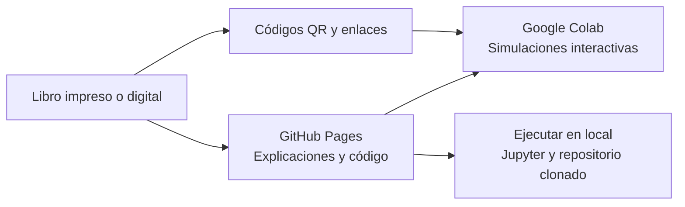

  

    
  

  

    <h1>Notas a mano sobre análisis de complejidad computacional</h1>
    
Segunda edición · 2026

    
Complemento digital de la obra. Síntesis conceptuales de los capítulos 1–9 y laboratorios ejecutables para los capítulos 2–8.

    <ul class="book-hero__authors" aria-label="Autores de la obra">
      <li>Carlos Eduardo Orozco Garcés</li>
      <li>César Jesús Pardo Calvache</li>
      <li>Mauro Callejas Cuervo</li>
    </ul>
    

      <a class="md-button md-button--primary book-hero__explore" href="capitulos/">
        <svg class="book-hero__explore-icon" aria-hidden="true" viewBox="0 0 24 24" focusable="false">
          <path d="M4 5.5A2.5 2.5 0 0 1 6.5 3H11a2 2 0 0 1 2 2v14.25A3.75 3.75 0 0 0 9.25 16H4V5.5Zm16 0V16h-5.25A3.75 3.75 0 0 0 11 19.25V5a2 2 0 0 1 2-2h4.5A2.5 2.5 0 0 1 20 5.5Z"/>
        </svg>
        Explorar capítulos
      </a>
      <a class="md-button md-button--primary book-hero__authors-link" href="autores/">
        <svg class="book-hero__authors-icon" aria-hidden="true" viewBox="0 0 24 24" focusable="false">
          <path d="M12 12a4 4 0 1 0 0-8 4 4 0 0 0 0 8Zm0 2c-4.42 0-8 2.24-8 5v1h16v-1c0-2.76-3.58-5-8-5Z"/>
        </svg>
        Sobre los autores
      </a>
      <a class="md-button md-button--primary book-hero__series-link" href="https://www.amazon.com/dp/B0DH2Z4VHD" target="_blank" rel="noopener noreferrer">
        <svg class="book-hero__series-icon" aria-hidden="true" viewBox="0 0 24 24" focusable="false">
          <path d="M6 3.5A2.5 2.5 0 0 1 8.5 1H17a2 2 0 0 1 2 2v17.25A3.75 3.75 0 0 0 15.25 17H6V3.5Zm12 0V17h-2.75A3.75 3.75 0 0 0 12 20.75V3a2 2 0 0 1 2-2h1.5A2.5 2.5 0 0 1 18 3.5ZM6 19h9.25c.69 0 1.34.19 1.9.52A5.74 5.74 0 0 0 15.25 19H6Z"/>
        </svg>
        Consultar la serie en Amazon
      </a>
    

  

## Mapa de aprendizaje del libro

De los fundamentos del análisis a la comparación razonada de algoritmos. Estas cinco etapas muestran cómo se conectan los capítulos y qué propósito cumple cada parte del recorrido.

  <article class="learning-roadmap__stage learning-roadmap__stage--foundations" role="listitem">
    
1

    

      
<strong>Comprender los fundamentos</strong>Capítulos 1–2

      
Introducción al análisis de complejidad, propiedades y familias de crecimiento.

      <em>Reconocerás cómo cambia el costo de un algoritmo cuando crece el tamaño de la entrada.</em>
      
<a href="capitulos/capitulo-1/">Capítulo 1</a><a href="capitulos/capitulo-2/">Capítulo 2</a>

    

  </article>
  <article class="learning-roadmap__stage learning-roadmap__stage--notation" role="listitem">
    
2

    

      
<strong>Expresar el comportamiento asintótico</strong>Capítulo 3

      
Familias de funciones y notaciones \(O\), \(o\), \(\Omega\), \(\omega\) y \(\Theta\).

      <em>Describirás límites de crecimiento y compararás funciones sin depender del hardware.</em>
      
<a href="capitulos/capitulo-3/">Capítulo 3</a>

    

  </article>
  <article class="learning-roadmap__stage learning-roadmap__stage--structured" role="listitem">
    
3

    

      
<strong>Analizar algoritmos estructurados</strong>Capítulo 4

      
Procedimiento para calcular el tiempo y el espacio a partir de secuencias, decisiones y ciclos.

      <em>Justificarás la complejidad de un algoritmo a partir de su estructura.</em>
      
<a href="capitulos/capitulo-4/">Capítulo 4</a>

    

  </article>
  <article class="learning-roadmap__stage learning-roadmap__stage--recursive" role="listitem">
    
4

    

      
<strong>Resolver y analizar la recursión</strong>Capítulos 5–6

      
Relaciones de recurrencia, métodos de solución y análisis de algoritmos recursivos.

      <em>Relacionarás las llamadas recursivas con su costo temporal y espacial.</em>
      
<a href="capitulos/capitulo-5/">Capítulo 5</a><a href="capitulos/capitulo-6/">Capítulo 6</a>

    

  </article>
  <article class="learning-roadmap__stage learning-roadmap__stage--algorithms" role="listitem">
    
5

    

      
<strong>Comparar y seleccionar algoritmos</strong>Capítulos 7–9

      
Algoritmos de búsqueda y ordenamiento, comparación de alternativas y reflexiones finales.

      <em>Elegirás una solución considerando sus casos, recursos y condiciones de uso.</em>
      
<a href="capitulos/capitulo-7/">Capítulo 7</a><a href="capitulos/capitulo-8/">Capítulo 8</a><a href="capitulos/capitulo-9/">Capítulo 9</a>

    

  </article>

  <strong>Durante todo el recorrido</strong>
  
Formula una hipótesis, contrástala con el análisis y utiliza las simulaciones para observar cómo las entradas modifican el comportamiento del algoritmo.

## Cómo se conectan los recursos

El diagrama resume el recorrido recomendado: el libro presenta los conceptos, Pages los organiza y las simulaciones permiten experimentarlos de forma interactiva o local.

## Cómo empezar

1. Si necesitas reforzar la notación matemática o los conceptos previos, consulta las [consideraciones teóricas](consideraciones-teoricas.md).
2. Revisa [Cómo usar los contenidos](recursos.md) para conocer la relación entre Pages, los notebooks y las simulaciones.
3. Elige la ruta que responda a tu objetivo: sigue el [recorrido por capítulos](capitulos/index.md), localiza una sección impresa mediante la [correspondencia libro–sitio](correspondencia.md), consulta el [glosario](glosario.md) o compara directamente las [búsquedas](capitulos/capitulo-7/0-comparacion-busquedas.md) y los [ordenamientos](capitulos/capitulo-8/0-comparacion-ordenamientos.md).
4. En los ejemplos, revisa el código ejecutable en Python, Java o C y abre la simulación de Google Colab para modificar entradas y contrastar el análisis.

!!! note "Alcance"
    El sitio orienta, resume y conecta los recursos de la obra. No reemplaza sus definiciones, demostraciones, implementaciones ni análisis completos.

Para reportar una errata o compartir una propuesta, visita la [fe de erratas](erratas.md) o [Comentarios y sugerencias](comentarios-sugerencias.md).
